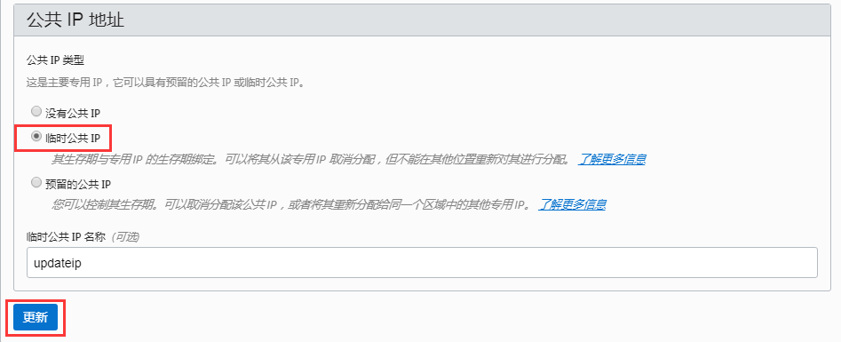
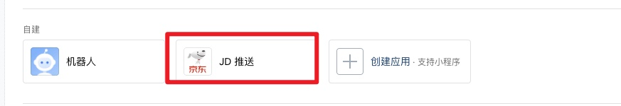

# 青龙面板相关操作

## 拉库

格式说明

```bash
# 对应意思 “库地址”  “拉哪些”  “不拉哪些”   “依赖文件”    “分支”
ql repo <repourl> <path> <blacklist> <dependence> <branch>
```

### faker3

> 内部互助版【安全本地 sign 防 CK 泄漏

```bash
ql repo https://git.metauniverse-cn.com/https://github.com/shufflewzc/faker3.git "jd_|jx_|gua_|jddj_|jdCookie" "activity|backUp" "^jd[^_]|USER|function|utils|sendNotify|ZooFaker_Necklace.js|JDJRValidator_|sign_graphics_validate|ql|JDSignValidator|magic|depend|h5sts" "main"
```

> 不拉取 重复禁用脚本版

```bash
ql repo https://git.metauniverse-cn.com/https://github.com/shufflewzc/faker3.git "jd*|jx*|gua*|jddj*|jdCookie" "activity|backUp|jd_identical" "^jd[^*]|USER|function|utils|sendNotify|ZooFaker*Necklace.js|JDJRValidator*|sign_graphics_validate|ql|JDSignValidator|magic|depend|h5sts" "main"
```

### faker2

> 助力池版【安全本地 sign 防 CK 泄漏】
>
> faker2 与 faker 3 的区别 https://www.kejiwanjia.com/circle/31411.html
>
> Faker2 仓库加入助力池，助力池的脚本助力会先行内部助力，助力次数剩余会进行助力池随机助力，可在群内机器人提交自己的互助码。Faker3 仓库去除助力池，为纯内部助力版本。

```bash
ql repo https://git.metauniverse-cn.com/https://github.com/shufflewzc/faker2.git "jd*|jx*|gua*|jddj*|jdCookie" "activity|backUp" "^jd[^_]|USER|function|utils|sendNotify|ZooFaker*Necklace.js|JDJRValidator*|sign_graphics_validate|ql|JDSignValidator|magic|depend|h5sts" "main"
```

### KingRan

> 这个是一个 活动比较多 的库

```bash
ql repo https://github.com/KingRan/KR.git "jd_|jx_|jdCookie" "activity|backUp" "^jd[^_]|USER|utils|function|sign|sendNotify|ql|JDJR"
```

### ccwav

> https://github.com/ccwav/QLScript2
>
> 这个库, 主要是发送通知的脚本, 好多脚本库的 通知脚本都是来源这里

```bash
ql repo https://github.com/ccwav/QLScript2.git "jd_" "NoUsed" "ql|sendNotify|utils|USER_AGENTS|jdCookie|JS_USER_AGENTS"
```

### 拉取单个脚本

```bash
# ql raw "脚本地址"
ql raw <fileurl>
```

## 解决 sendNotify 被覆盖问题

```bash
# 4. ql repo拉库逻辑
# ql repo 会默认复制 deps 目录下的文件到仓库目录，所以你要固定你的 sendNotify 或者其他文件时，只需要把文件放到deps目录即可

docker exec -it qinglong /bin/bash
cd /ql/data/deps/
wget -O sendNotify.js https://raw.githubusercontent.com/ccwav/QLScript2/main/sendNotify.js
```

## 一些常用的命令

- 进入 docker 容器

```bash
docker exec -it qinglong /bin/bash
```

- 查看容器

```bash
docker ps
docker ps -l # 查看正在运行的容器
docker ps -a # 查看所有容器
```

- 启动所有容器

```bash
docker start $(docker ps -a | awk '{ print $1}' | tail -n +2)
```

- 关闭所有容器

```bash
- docker stop $(docker ps -a | awk '{ print $1}' | tail -n +2)
```

- 删除所有容器

```bash
docker rm $(docker ps -a | awk '{ print $1}' | tail -n +2)
```

- 删除所有镜像

```bash
docker rmi $(docker p_w_picpaths | awk '{print $3}' |tail -n +2)
```

- 重启所有容器

```bash
docker restart $(docker ps -a | awk '{ print $1}' | tail -n +2)
```

## 设置 jbot 监控活动

### 方案一

1. 进入 `http://144.24.86.199:5700/script`, 打开 `jk.json`
2. 修改活动
3. 进入 `http://144.24.86.199:5700/crontab`, 执行 `替换 jbot 监控`

### 方案 二

```bash
docker exec -it qinglong /bin/bash

cd /ql/data/jbot/conf

rm jk.json && touch jk.json && vi jk.json
```

## docker 容器自启动

### 方案 1

:::info 在创建容器时设置，添加参数 `--restart=always`
:::

```bash
docker run -d --restart=always --name 设置容器名 使用的镜像
（上面命令  --name后面两个参数根据实际情况自行修改）

# Docker 容器的重启策略如下：
 --restart具体参数值详细信息：
       no　　　　　　　 // 默认策略,容器退出时不重启容器；
       on-failure　　  // 在容器非正常退出时（退出状态非0）才重新启动容器；
       on-failure:3    // 在容器非正常退出时重启容器，最多重启3次；
       always　　　　  // 无论退出状态是如何，都重启容器；
       unless-stopped  // 在容器退出时总是重启容器，但是不考虑在 Docker 守护进程启动时就已经停止了的容器。
```

### 方案 2

:::info 使用 `update` 修改已有容器
:::

```bash
docker update --restart=always 容器ID(或者容器名)
# 容器ID或者容器名根据实际情况修改
```

## 查看存储的环境变量

> JD_WSCK

```bash
docker exec -it qinglong /bin/bash
cat /ql/data/config/env.sh
```

## 甲骨文 服务器 IP 更新

> 计算-->实例-->实例详细信息-->附加的 VNIC-->VNIC 详细信息-->IP 地址-->编辑-->临时公共 IP-->更新
>
> https://www.dueryou.com/178.html



## 更新 企业微信程序 IP 白名单

1. 打开 https://work.weixin.qq.com/wework_admin/frame#apps
2. 找到 建立的 机器人程序 点击



3. 下拉到最后, 找到 `企业可信 IP`, 点击 `配置`, 即可更新
