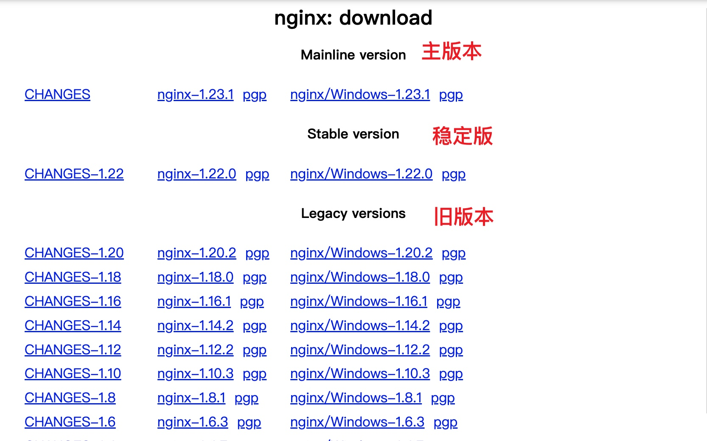

# 将 nginx 注册为系统服务

## nginx 下载及安装

1. 下载地址 https://nginx.org/en/download.html



2. 将 下载的 `nginx.zip` 解压`目录 A`(自定义)

## winsw 下载及配置

1. 下载地址 https://repo.jenkins-ci.org/releases/com/sun/winsw/winsw/

- 将下载的 `winsw-xxx-bin.exe`, 命名为 `nginx-service.exe`, 并复制到 `目录 A`
- `目录 A` 新建 `nginx-service.xml`

```xml
<service>
  <id>nginx</id>
  <name>nginx</name>
  <description>nginx</description>
  <env name="path" value="目录 A"/>
  <executable>目录 A/nginx.exe</executable>
  <arguments>-p 目录 A</arguments>
  <logpath>目录 A/logs/</logpath>
  <logmode>roll</logmode>
</service>
```

- 管理员运行 `cmd`, 进入 `目录 A`,执行 `nginx-service.exe install`

  - 卸载服务 执行 `nginx-service.exe uninstall`

- `win+r` 输入 `services.msc` 打开服务窗口, 启动 `nginx`

## 部署脚本

:::info 部署脚本
[地址](../../web/vue2/depoly.md#部署到-nginx)
:::
