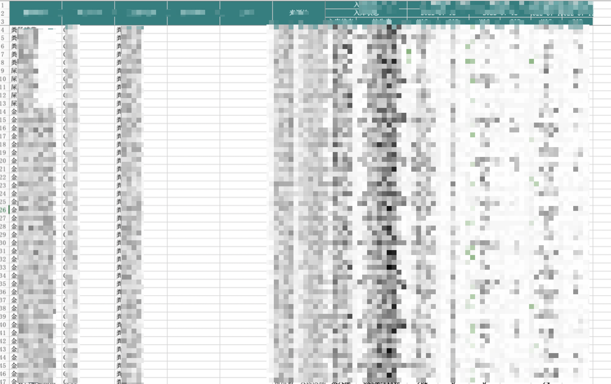

# Excel 方案

## 通过 ExcelJS 实现纯前端复杂 excel 导出

[文档地址](https://github.com/exceljs/exceljs/blob/master/README_zh.md)

:::info 安装
::: code-tabs#bash

@tab:active yarn

```bash
yarn add exceljs
```

@tab npm

```bash
npm install exceljs
```

:::

## 示例

结果:



```js
// download-excel.js
import { saveAs } from "file-saver";

export function saveWorkbook(workbook, fileName) {
  // 导出文件
  workbook.xlsx.writeBuffer().then((data) => {
    const blob = new Blob([data], { type: "" });
    saveAs(blob, fileName);
  });
}

// 业务代码

// 创建工作簿
const workbook = new ExcelJS.Workbook();
// 创建带有红色标签颜色的工作表
const sheet1 = workbook.addWorksheet("Sheet1", {
  views: [{ state: "frozen", xSplit: 6, ySplit: 3 }],
});
// 表头
const headerRows = [
  [
    "菌株名称",
    "样本序号",
    "样本类型",
    "菌株编号",
    "批号",
    "来源地",
    "入库状态",
    "抗生素",
  ],
  [
    "菌株名称",
    "样本序号",
    "样本类型",
    "菌株编号",
    "批号",
    "来源地",
    "入库状态",
    "抗生素",
  ],
  [
    "菌株名称",
    "样本序号",
    "样本类型",
    "菌株编号",
    "批号",
    "来源地",
    "入库状态",
    "抗生素",
  ],
];
// 添加表头
for (const methodologies of this.validMethodologies.values()) {
  const { methodologyName = "", experimentDate = "" } = methodologies;
  headerRows[0].push(methodologyName, methodologyName);
  headerRows[1].push(experimentDate, experimentDate);
  headerRows[2].push("MIC", "SIR");
}

sheet1.addRows(headerRows);
// 添加 数据行
const dataRows = [];
for (const row of this.selectedRows.values()) {
  const storeState =
    row.storeState === 1
      ? "已入库"
      : row.storeState === 0
      ? "待入库"
      : "未入库";
  const crow = [
    row.getName,
    row.sampleNo,
    row.sampleType,
    row.sourceNo,
    row.sourceLotNo,
    row.sourceAddr,
    storeState,
    row.antibiotic,
  ];

  for (const methodologies of this.validMethodologies.values()) {
    const { methodologyID, experimentDate } = methodologies;
    const frow =
      this.tableRawData.find(
        (rawRow) =>
          rawRow.getName === row.getName &&
          rawRow.sourceNo === row.sourceNo &&
          rawRow.sourceLotNo === row.sourceLotNo &&
          rawRow.sourceAddr === row.sourceAddr &&
          rawRow.storeState === row.storeState &&
          rawRow.antibiotic === row.antibiotic &&
          rawRow.methodologyID === methodologyID &&
          rawRow.experimentDate === experimentDate
      ) ?? {};
    crow.push(frow.micValue ?? "", frow.drugSusceptibilityExplanation ?? "");
  }

  dataRows.push(crow);
}
sheet1.addRows(dataRows);
// 表头前 6 列合并
sheet1.mergeCells("A1:A3");
sheet1.mergeCells("B1:B3");
sheet1.mergeCells("C1:C3");
sheet1.mergeCells("D1:D3");
sheet1.mergeCells("E1:E3");
sheet1.mergeCells("F1:F3");
// 表头6 列以后 两两合并
for (const idx of this.validMethodologies.keys()) {
  sheet1.mergeCells(1, 7 + idx * 2, 1, 8 + idx * 2);
  sheet1.mergeCells(2, 7 + idx * 2, 2, 8 + idx * 2);
}
// 设置样式
sheet1.eachRow((row, rowNumber) => {
  row.eachCell((cell, cellNumber) => {
    // console.log(`rowNumber ${rowNumber},cellNumber ${cellNumber}`)
    // 设置前三行(表头) 样式
    if (rowNumber <= 3) {
      cell.alignment = {
        vertical: "middle",
        horizontal: "center",
        wrapText: false,
      };
      cell.fill = {
        type: "pattern",
        pattern: "solid",
        fgColor: { argb: "FF008080" },
      };
      cell.border = {
        top: { style: "thin", color: { argb: "FFD3D3D3" } },
        left: { style: "thin", color: { argb: "FFD3D3D3" } },
        bottom: { style: "thin", color: { argb: "FFD3D3D3" } },
        right: { style: "thin", color: { argb: "FFD3D3D3" } },
      };
      cell.font = {
        color: { argb: "FFFFFFFF" },
      };
    } else {
      // 三行以后 数据行的样式
      if (cellNumber > 6) {
        cell.alignment = {
          vertical: "middle",
          horizontal: "center",
          wrapText: false,
        };
        cell.font = {
          bold: true,
        };
      }
      if (cellNumber === 5) {
        cell.alignment = {
          vertical: "middle",
          horizontal: "center",
          wrapText: false,
        };
      }
      // const rowStoreState = row.getCell(5).value

      // const fgColor = rowStoreState === '已入库' ? '1e008080' : (rowStoreState === '待入库' ? '1ee6a23c' : '1ef56c6c')

      // cell.fill = {
      //   type: 'pattern',
      //   pattern: 'solid',
      //   fgColor: { argb: fgColor }
      // }
      // cell.border = {
      //   left: { style: 'thin', color: { argb: 'FFD3D3D3' }},
      //   bottom: { style: 'thin', color: { argb: 'FFD3D3D3' }},
      //   right: { style: 'thin', color: { argb: 'FFD3D3D3' }}
      // }
    }
  });
});

// 设置前 6 列 width
for (let i = 1; i <= 6; i++) {
  sheet1.getColumn(i).width = 15;
}

saveWorkbook(workbook, `${new Date().getTime()}.xlsx`);
```
