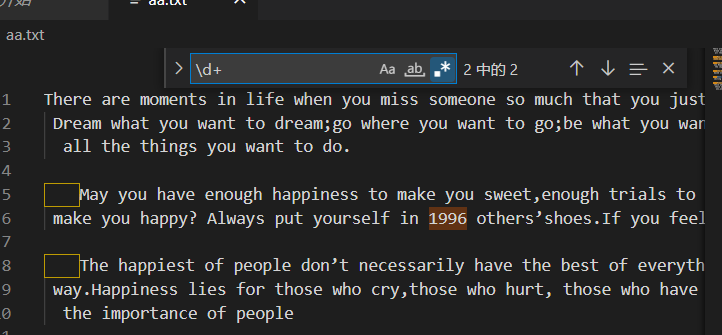

# 厉害！这篇正则表达式竟写的如此详尽

前言

## 为什么要学正则表达式？

作为一个菜鸟程序员，遇到复杂的正则时往往会求助**搜索引擎**。虽然能够解决燃眉之急，但往往会有\[边界值\] https://blog.csdn.net/weixin\_33994444/article/details/93408973 和团队正则不统一的问题。而这种问题往往会被细测测出来，造成不必要的麻烦。对于这种情况，最好的解决方式就是去吃透它，最终能将它手写出来。所谓知其然，也要知其所以然。


## 什么是正则表达式？

1951 年,一位名叫史蒂芬·克林（Stephen Kleene）的数学科学家，发表了一篇名叫《神经网事件的表示法》的论文。论文中引入了`正则表达式`的概念。直至七十多年后的今天，`正则表达式`仍然影响着我们互联网生活的方方面面。


比如需要填入**符合特定规则**的密码、手机号、邮箱等。


又比如我们需要对输入框加一个中文、英文或价格等**输入限制**。

不过在我们学习正则表达式之前，我们需要先熟悉下它的**调试工具**。

## 怎么检测我的正则对不对呢？

### 编辑器内置的搜索工具

我们可以使用 Vscode (https://code.visualstudio.com/) 提供的正则的搜索方法，来使用正则匹配我们需要搜索的内容。



### 函数调用

也可以在自己熟悉的编程语言中调用函数去测试。


### 在线测试网站

亦或是使用我这边推荐的一个\[在线测试网站\] https://c.runoob.com/front-end/854/


了解了调试工具后我们开始从**基础**学习吧。

## 基础

### 限定符 (Quantifiers)

#### ?


`?` 表示前面的字符可以出现 **1 次或者 0 次**。说简单点就是 "co" 中的 "o" 这个字母可有可无。

#### +


`+` 表示前面的字符至少匹配 **1 次或多次**。比如上列中 `poverty`、`poor` 得到了匹配。`premier` 却没有匹配。

#### \*


`\*`可以匹配 **0 个或者多个字符**。可以看到出现 0 次的 `pr` 和 2 次的 `poor` 得到了匹配。我们如何匹配**固定次数**或**一定范围**的字符呢？

#### \{...}


`{...}` 可以用来匹配**固定数量**的字符或**某个范围**内的字符。

如上图所示：

- `{2}` 当只有一个参数时，只匹配固定数量。
- `{2,3}` 当有两个参数时，匹配范围内的。
- `{2,}` 当后面的参数为空时，匹配 n 个及以上。

#### (...)

以上都讲的是匹配单个字符，当我们想匹配**多个字符**该怎么办呢？


我们可以将我们需要匹配的字符用 `(...)` 括起来，可以看到 `(...)` 搭配我们上文所学的 `+` 成功匹配了 `banana` 和 `anna`。

### 或运算符 (OR Operator)


当我们需要匹配**两个或多个条件**时我们就需要使用 `|` (或运算符)。图中我们匹配了拥有 `an` 或 `na` 的单词。值得注意的是这里的 `｜` 最外层的 `()` 是必不可少的。

### 字符类(Character class)


比如我们要匹配**拥有 `123` 中任意字符**的字符串则需要使用 `\[...\]`, 需要匹配的字符只能取自方括号中的内容。另外我们也可以使用字符类去匹配指定范围，如 \[a-z\]、\[0-9\]、\[\\u4e00-\\u9fa5\] 等。


另外我们也可以在前面加 `^` 用来匹配**非此范围**的字符串，如上我们就匹配了非英文的字符串。

另外正则表达式也提供了很多`元字符`可以让我们简写我们的正则表达式。

### 元字符 (Meta character)


我们可以使用 `\\d` 代替我们之前的 `\[0-9\]`, 这里还有两个特殊字符 `^` 会匹配**开始**(这里要注意与我们前面讲到的`字符类`中的运用要区分)，`$` 会匹配结束。

> `
>
> - \\d,\\w,\\s - 匹配数字、字符、空格(分别代表着：digit、word、space)。
> - \\D,\\W,\\S - 匹配非数字、非字符、非空格。
> - . - 除换行符以外的所有字符(句号句子的结束符)。
> - ^ - 字符串开头。
> - $ - 字符串结尾。

接下来我们来学习一下正则表达式的**高级概念**。

## 高级概念

### 懒惰匹配和贪婪匹配 (Lazy and Greed)

当我们想要匹配文本中的 HTML 时我们会写下如下正则表达式。


根据前面的知识我们知道，此正则将会匹配<开头>结尾中间可以有至少 1 个任意字符。但结果是匹配了`<`和`>` 标签包含的所有内容。


我们可以在正则表达式中加`?`来开启`懒惰匹配`。开启懒惰匹配后，正则会**尽可能少的匹配**。所以当匹配的时候发现标签 `<div>` 已经是符合要求的，所以会匹配 `<div>` 标签，然后继续向下匹配，发现 `</div>` 标签也是符合要求的，继续向下匹配，发现文字不符合要求，继续向下，发现 `<span>` 和 `</span>` 标签都是符合要求的，所以最后会匹配 `<div>`, `</div>`, `<span>`, `</span>` 四个标签。

### 分组 (Group)

前面我们认识了 `(...)` 的用法，将其结合我们后面所学的知识就是正则的`分组`。


如上图所示第一个分组中我们匹配 4 个数字，第二个分组中我们匹配 7 个数字。中间使用 `-` 进行连接，便很容易匹配到了文本中出现的座机电话号。

### 非捕获分组 (Non-capture Group)

非捕获分组：`(?:表达式)`，分组匹配之后，不需要的用 `?: `语法过滤子表达式内容。也就是代码匹配，但是不保存。

在使用非捕获前:


在使用非捕获后:


通过 `.exec` 方法并没有捕获到月份。

### 回溯 (Flash Back)

当我们想匹配一个正确的 HTML 标签时，使用 "<\[\\w\]+>.\*<\\/\[\\w\]+>"。


可以看到虽然可以匹配 HTML 开始和结束标签，但是**却不能校验前后的一致性**。如 `</span>` 并不是 `<div>` 的结束标签。


我们可以把后面的部分改成 `<\\/\\1>` 其中 `\\1` 就是引用第一个`分组`。这样一来我们就可以匹配正确的 HTML 标签了。

### 断言 (Assertion)

**断言**有些地方也叫环视(Lookaround)，它只进行子表达式的匹配，不占有字符，匹配到的内容不保存到最终的匹配结果。

#### 正向先行断言

正向先行断言：`(?=表达式)`，指在某个位置往右看，所在的位置右侧必须匹配`表达式`。


我们可以看到`/喜欢(?=你)`正确匹配到了`你`前面有`喜欢`的文本。

##### 实现一个密码强度校验

> `
>
> 至少有一个大写字母。至少有一个小写字母。至少有一个数字。至少有 8 个字符。


#### 反向先行断言

反向先行断言：`(?!表达式)`，指在某个位置往右看，不能存在`表达式`中的内容。


如上就排除了`喜欢`后面有`你`的字符串。

#### 正向后行断言

正向后行断言：`(?<=表达式)`，指在某个位置往左看，存在`表达式`中的内容。


如上就匹配了`喜欢`前面有`我`的字符串。

#### 反向后行断言

反向后行断言：`(?<!表达式)`，指在某个位置往左看，不能存在`表达式`中的内容。


如上就排除了`喜欢`前面有`我`的字符串。

至此正则表达式的**高级部分**学完啦，接下来我们学习正则提供的**方法**。

## 方法

在 JavaScript 中，`RegExp` 对象是一个预定义了属性和方法的正则表达式对象。

### test()


该方法用于检测一个字符串是否匹配某个正则表达式，**匹配**返回 true，**不匹配**返回 false。

### exec()


该方法用于检测字符串中对正则表达式的匹配。

该函数返回一个**数组**，其中存放匹配的结果。如果未找到匹配，则返回值为 null。

除了正则自身携带的方法，配合 **String 对象**的方法一起使用也会有额外的效果。

## 配合 String 提供的方法

### match

match 这个方法主要用来提取数据，它配合分组的（）一起使用，可以很方便提取数据。

```js
var str = "2022-04-22";
var reg = /^(\d{4})-(\d{2})-(\d{2})$/;
console.log(str.match(reg)); //  ['2022-04-22', '2022', '04', '22', index: 0, input: '2022-04-22', groups: undefined]
```

### replace

replace 这个 api 主要用于替换数据，多用于字符串的处理和转义。

```js
var str = "贾维斯：您今天共产生了8个BUG";
var reg = /\w{3}/g;
console.log(str.replace(reg, "Beautiful Code")); // 贾维斯：您今天共产生了8个Beautiful Code
```

#### 什么是 $ 1 $ 2

```js
let str = "前端1组-开发部";
console.log(str.replace(/(.{4})-(.{3})/, "$2 $1")); // 开发部 前端 1 组
```

**$1**,**$2** 上就是按顺序对应小括号里面的**分组** 捕获到的内容。这里我们将 2 组和 1 组进行内容替换，就得到了替换后的内容。

### split

**split** 主要用于来切分字符串为数组，它的第一个参数也可以为正则的形式。

```js
const str1 = "2022-04-21";
const str2 = "2022.04.22";
const str3 = "2022/04/23";
const regsSplit = /[\.\-\/]/;
console.log(str1.split(regsSplit));
console.log(str2.split(regsSplit));
console.log(str3.split(regsSplit)); // ['2022', '04', '21']   // ['2022', '04', '22']   // ['2022', '04', '23']
```

了解完了，结合 String 用法，我们再来了解一下**兼容性问题**。

## 正则表达式兼容性调研

在我们日常使用中，一定会遇到兼容性问题。这里主要对一些不完全兼容的方法进行调研。

### @@split

`@@split` 方法切割 String 对象为一个其子字符串的数组 。

```js
var re = /-/g;
var str = "2022-01-02";
var result = re[Symbol.split](str);
console.log(result); // ["2022", "01", "02"]
```

兼容性


### @@match

对正则表达式匹配字符串时，`@@match` 方法用于获取匹配结果。

```js
var re = /[0-9]+/g;
var str = "2022-01-02";
var result = re[Symbol.match](str);
console.log(result); // ["2022", "01", "02"]
```

兼容性


### @@search

`@@search` 方法执行了一个在给定字符串中的一个搜索以取得匹配正则模式的项。

```js
var re = /-/g;
var str = "2016-01-02";
var result = re[Symbol.search](str);
console.log(result); // 4
```

兼容性


### @@replace

`@@replace` 方法会在一个字符串中用给定的替换器，替换所有符合正则模式的匹配项，并返回替换后的新字符串结果。用来替换的参数可以是一个字符串或是一个针对每次匹配的回调函数。

```js
var re = /-/g;
var str = "2016-01-01";
var newstr = re[Symbol.replace](str, ".");
console.log(newstr); // 2016.01.01
```

兼容性


### flags

`flags` 属性返回一个字符串，由当前正则表达式对象的标志组成。

```js
/foo/gi.flags; // "gi"
/bar/muy.flags; // "muy"
```

兼容性


### dotAll

正则中的点匹配就是 `dotAll` ，都是匹配任意字符，但是很多字符是无法匹配的。例如：

- 四个字节的 `UTF-16` 的字符
- 行终止符 `\n` `\r` 换行 回车

```js
console.log(/foo.bar/.test("foo\nbar")); // false
console.log(/foo.bar/.test("fooabar")); // true
```

加上 `s` 可以匹配换行符

```js
console.log(/foo.bar/s.test("foo\nbar")); // true
```

兼容性


最后我们让来点**干货**吧

## 干货

### 保留两位小数的价格输入框

具体代码如下：

```js
// 输入限制   å
const changePiece = (e) => {
  e.target.value = e.target.value.replace(/^\D*(\d*(?:\.\d{0,2})?).*$/g, "$1");
};
return (
  <div>
    <input
      type="text"
      onKeyUp={(e) => {
        changePiece(e);
      }}
    />
  </div>
);
```

### 常用正则表达式

```js
// 手机号码的校验
const phoneReg = /^[1][3,4,5,6,7,8,9][0-9]{9}$/;
// 身份证的校验
const idCardReg =
  /^[1-9]\d{5}(18|19|([23]\d))\d{2}((0[1-9])|(10|11|12))(([0-2][1-9])|10|20|30|31)\d{3}[0-9Xx]$/;
// URL的校验
const urlReg =
  /^((https?|ftp|file):\/\/)?([\da-z\.-]+)\.([a-z\.]{2,6})([\/\w \.-]*)*\/?$/;
// 邮箱的校验
const emailReg = /^([A-Za-z0-9_\-\.])+\@([A-Za-z0-9_\-\.])+\.([A-Za-z]{2,4})$/;
// 日期 YYYY-MM-DD 校验
const dateReg = /^\d{4}(\-)\d{1,2}\1\d{1,2}$/;
```

### 参考

《Can I Use——正则表达式》(https://caniuse.com/?search=RegExp)

《有了这 25 个正则表达式，代码效率提高 80%》(https://juejin.cn/post/7016871226899431431)

《10 分钟快速掌握正则表达式》 (https://www.bilibili.com/video/BV1da4y1p7iZ?spm\_id\_from=333.337.search-card.all.click

本文转自 [https://mp.weixin.qq.com/s/OqTSmltRGp12mRTEfjVuyg](https://mp.weixin.qq.com/s/OqTSmltRGp12mRTEfjVuyg)，如有侵权，请联系删除。
